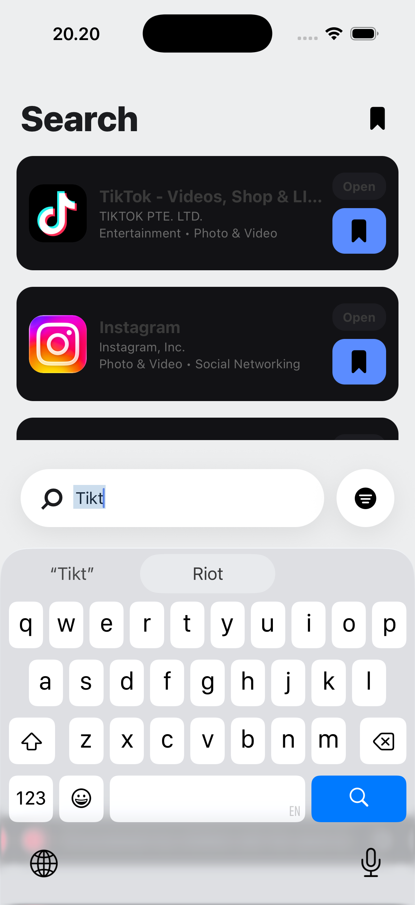

This is a React Native app built the modern way — **no Expo**.  
This app lets you search for iOS/macOS/watchOS apps via the iTunes API, preview them, and bookmark them to check out later.

---

## 🚀 What This App Does
- Search the App Store (using iTunes Search API)
- Filter by:
  - Country (e.g., US, CN)
  - Platform (iOS, macOS, watchOS, tvOS)
---

## 🧠 Architecture Overview
We follow a **Clean Architecture** pattern — a small but mighty setup that keeps the code organized, testable, and easy to scale.

```
src/
├── domain/            # Core business entities & repository contracts
├── data/              # Implementations that talk to APIs or local storage
├── infra/             # Network abstraction (fetch wrapper, etc.)
├── application/       # Hooks & contexts for state and use-cases
├── presentation/      # Screens, components, navigation, themes, i18n
└── main.tsx           # App entry (providers + navigation)
```

### Layers in simple terms
- **Domain:** Think of this as the “what” — defines what data and rules exist.
- **Data:** The “how” — how we fetch or store that data (e.g., iTunes API, MMKV).
- **Infra:** Reusable utilities like a `fetch` wrapper.
- **Application:** Glue between data and UI — hooks and context logic.
- **Presentation:** The actual app you see (screens, navigation, components).

Everything is split for **clarity** and **testability**, without adding unnecessary libraries.

---

## 🧰 Tech Stack

| Area | Tool / Library | Why |
|------|----------------|-----|
| Core | **React Native 0.82** | Modern architecture, no Expo |
| Navigation | `@react-navigation/native` + `native-stack` | Lightweight and fast native nav |
| Storage | `react-native-mmkv` | Super fast key-value storage for bookmarks |
| Network | Native `fetch` + custom abstraction | Simpler and future-proof |
| UI Effects | `react-native-linear-gradient` | Shimmer placeholder |
| Web | `react-native-webview` | App Store preview |
| Localization | `i18next` + `react-i18next` + `react-native-localize` | English / Chinese |
| Connectivity | `@react-native-community/netinfo` | Detect offline mode |
| Animations | `react-native-reanimated` | Smooth swipe-to-remove & transitions |
| State Mgmt | React Context | Clean, minimal, no Redux or Zustand |

---

## 🏗️ How to Run It

1. Clone the repo  
   ```bash
   git clone <your-repo-url>
   cd appfinder
   ```

2. Install dependencies  
   ```bash
   npm install
   ```

3. Install pods (iOS only)  
   ```bash
   cd ios && pod install && cd ..
   ```

4. Run the app  
   ```bash
   npm run ios   # or npm run android
   ```

---

## 🧩 Folder Breakdown (Quick Tour)
- **/presentation/screens** → Each screen (Onboarding, Search, Bookmarks, WebPreview)
- **/application/state** → Contexts for Onboarding & Bookmarks
- **/application/query** → Hooks for API logic (like `useSearchApps`)
- **/data/datasources** → The actual iTunes API calls
- **/infra/http** → Our `fetch` abstraction with timeout & error handling
- **/domain** → Contracts (`AppRepo`) + Entities (`AppItem`)

---


## 🖼️ Demo Screenshots
Feel free to drop screenshots or GIFs of your app demo here 👇  
(You can replace this section with actual images once you have them)

<details>
<summary>

</summary>

</details>

---

## 💡 Contributing

This project is **open for contributors** 🙌  
If you have ideas for improvements, new features, or just want to clean up code, feel free to fork and open a pull request.

